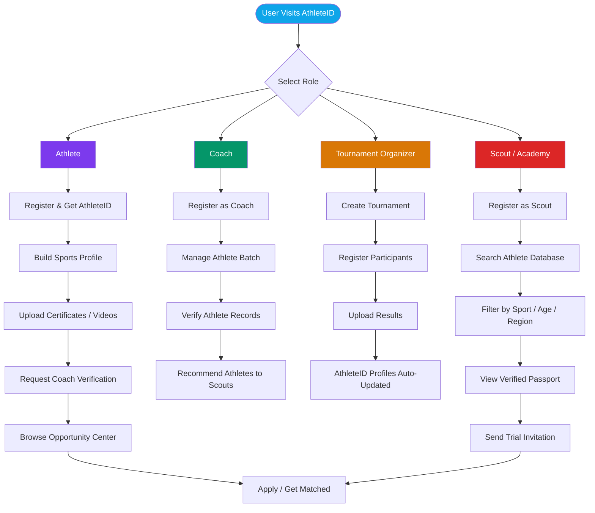
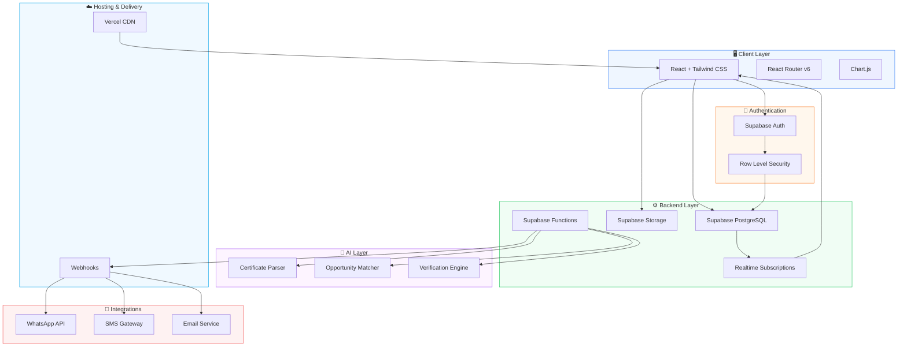
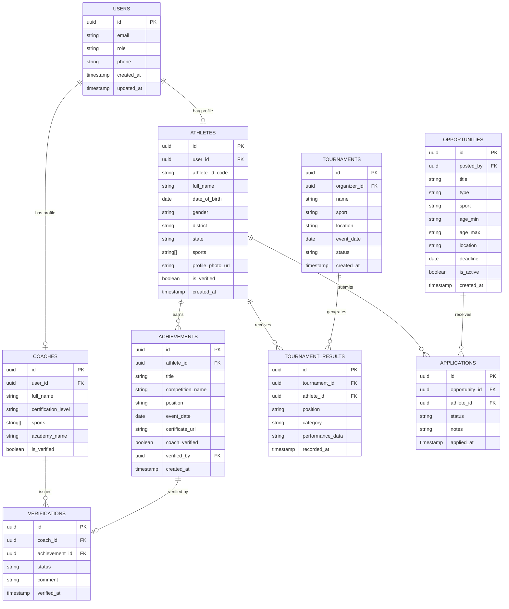
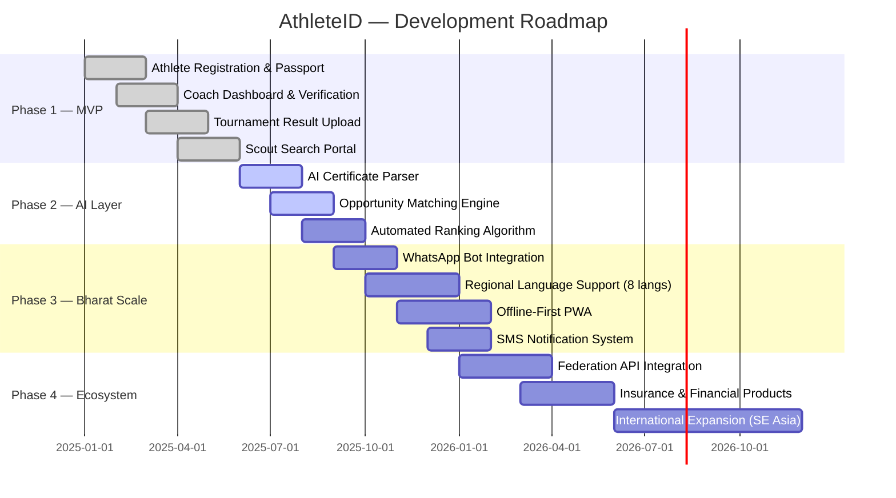

<div align="center">


<br/>

[](https://github.com/seyansiuu/athleteid)
[](https://www.samsung.com/in/solvefortomorrow/)
[](./LICENSE)
[](./CONTRIBUTING.md)
[](https://athleteid.vercel.app)

<br/>

**AthleteID** is India's Digital Sports Passport and Opportunity Network —  
a permanent, verifiable sporting identity for every athlete across rural, Tier 2, and Tier 3 India.

<br/>

[🚀 Live Demo](https://athleteid.vercel.app) · [📖 Docs](./docs) · [🐛 Report Bug](https://github.com/seyansiuu/athleteid/issues) · [✨ Request Feature](https://github.com/seyansiuu/athleteid/issues)

<br/>

</div>

---

## 📋 Table of Contents

- [The Problem](#-the-problem)
- [Why AthleteID Exists](#-why-athleteid-exists)
- [Key Features](#-key-features)
- [Product Screens](#-product-screens)
- [User Roles](#-user-roles--responsibilities)
- [User Flow](#-user-flow)
- [System Architecture](#-system-architecture)
- [Database Schema](#-database-er-diagram)
- [Tech Stack](#-tech-stack)
- [Folder Structure](#-folder-structure)
- [Local Installation](#-local-installation)
- [Environment Variables](#-environment-variables)
- [Supabase Setup](#-supabase-setup-guide)
- [Running the Project](#-running-the-project)
- [Deployment](#-deployment-guide)
- [API Overview](#-api-overview)
- [Roadmap](#-future-roadmap)
- [Contributing](#-contributing)
- [Samsung Solve for Tomorrow](#-samsung-solve-for-tomorrow)
- [Team](#-team)
- [License](#-license)

---

## 🔴 The Problem

> **230 million athletes** participate in organised sport across India. Almost none of them have a permanent, verifiable record of their achievements.

A 16-year-old wrestler in Jharkhand wins three district championships. A kabaddi player from a village in Maharashtra is the fastest in her state. A young cricketer in Tamil Nadu has been coached by a national-level mentor for five years.

**None of them have proof. None of them are discoverable.**

| Pain Point | Reality |
|---|---|
| 🗂️ Fragmented records | Certificates are lost, photos fade, WhatsApp videos disappear |
| 🔍 Zero discoverability | Scouts from academies rely entirely on personal networks |
| 📋 Manual processes | Scholarship applications require weeks of document hunting |
| 🏚️ Geographic bias | Talent pipelines are built in metros, not where talent lives |
| ❌ No verification | No trusted way to validate athlete claims |

---

## 💡 Why AthleteID Exists

AthleteID was built on a single belief: **talent should be discovered by performance, not geography or connections.**

India's sports ecosystem has a structural failure at the grassroots level. The Sports Authority of India (SAI), state academies, IPL youth programmes, and scholarship providers all want to find undiscovered talent — but they have no infrastructure to do so outside major cities.

AthleteID is that infrastructure.

- A **permanent digital sports passport** that follows an athlete throughout their career
- A **verified talent database** that scouts, academies, and scholarship providers can search
- A **tournament integration layer** that creates athlete records as a byproduct of competition
- An **opportunity engine** that matches athletes to trials, camps, and scholarships
- Built for **Bharat-first**: WhatsApp integration, coach-led onboarding, offline-tolerant design

---

## ✨ Key Features

<table>
<tr>
<td width="50%">

### 🪪 Digital Sports Passport
Every athlete receives a unique **AthleteID** — a permanent, shareable profile containing achievements, videos, rankings, certificates, and verified performance history.

</td>
<td width="50%">

### 🤖 AI Certificate Parsing
Upload any sports certificate, result sheet, or document — our AI extracts and structures the data automatically, eliminating manual data entry.

</td>
</tr>
<tr>
<td width="50%">

### 🏆 Tournament Integration
Tournament organizers can run their events on AthleteID. Every result is automatically written to participant profiles — no athlete sign-up required.

</td>
<td width="50%">

### 🔍 Scout Search Portal
Scouts and academies can filter athletes by sport, age, district, state, performance metric, and verification status — across all of India.

</td>
</tr>
<tr>
<td width="50%">

### 🎯 Opportunity Matching
Athletes receive notifications for trials, scholarship applications, talent camps, and academy invitations that match their sport, age, and location.

</td>
<td width="50%">

### ✅ Coach Verification
Coaches can verify athlete achievements from within the platform, adding a trusted layer of credibility to self-reported records.

</td>
</tr>
</table>

---

## 📱 Product Screens

> **Note:** Replace the placeholders below with actual screenshots before publishing.

<div align="center">

| Athlete Passport | Scout Dashboard | Coach Portal |
|:---:|:---:|:---:|
|  |  |  |
| *Permanent digital identity* | *Filtered athlete discovery* | *Batch management + verification* |

| Opportunity Center | Tournament Upload | AI Certificate Parser |
|:---:|:---:|:---:|
|  |  |  |
| *Personalised opportunity feed* | *Bulk result ingestion* | *Automated record extraction* |

</div>

---

## 👥 User Roles & Responsibilities

```
┌─────────────────────────────────────────────────────────────────┐
│                       ATHLETEID ECOSYSTEM                       │
├──────────────┬──────────────┬──────────────┬────────────────────┤
│   ATHLETE    │    COACH     │  ORGANIZER   │      SCOUT         │
├──────────────┼──────────────┼──────────────┼────────────────────┤
│ Create ID    │ Verify achv. │ Upload       │ Search athletes    │
│ Build profile│ Manage batch │ results      │ Filter by metrics  │
│ Upload certs │ Recommend    │ Create event │ Send invitations   │
│ Track record │ athletes     │ profiles     │ View full passport │
│ Apply for    │ View stats   │ Issue        │ Bookmark profiles  │
│ opportunities│              │ certificates │                    │
├──────────────┴──────────────┴──────────────┴────────────────────┤
│   SCHOOL / ACADEMY             │   SCHOLARSHIP PROVIDER         │
├────────────────────────────────┼────────────────────────────────┤
│ Onboard students in bulk       │ Post scholarship opportunities │
│ Track cohort performance       │ Set eligibility criteria       │
│ Manage team profiles           │ Review verified applications   │
│ Run institutional tournaments  │ Award and track recipients     │
└────────────────────────────────┴────────────────────────────────┘
```

---

## 🔄 User Flow



---

## 🏗️ System Architecture



---

## 🗄️ Database ER Diagram



---

## 📁 Folder Structure

```
athleteid/
├── public/
│   ├── favicon.ico
│   ├── logo.svg
│   └── og-image.png
│
├── src/
│   ├── assets/
│   │   ├── images/
│   │   └── icons/
│   │
│   ├── components/
│   │   ├── common/
│   │   │   ├── Button.jsx
│   │   │   ├── Card.jsx
│   │   │   ├── Input.jsx
│   │   │   ├── Modal.jsx
│   │   │   ├── Navbar.jsx
│   │   │   ├── Sidebar.jsx
│   │   │   └── LoadingSpinner.jsx
│   │   │
│   │   ├── athlete/
│   │   │   ├── AthletePassport.jsx
│   │   │   ├── AchievementCard.jsx
│   │   │   ├── CertificateUploader.jsx
│   │   │   └── PerformanceChart.jsx
│   │   │
│   │   ├── coach/
│   │   │   ├── CoachDashboard.jsx
│   │   │   ├── BatchManager.jsx
│   │   │   └── VerificationForm.jsx
│   │   │
│   │   ├── scout/
│   │   │   ├── ScoutSearchPortal.jsx
│   │   │   ├── AthleteFilter.jsx
│   │   │   └── SavedProfiles.jsx
│   │   │
│   │   ├── tournament/
│   │   │   ├── TournamentCreator.jsx
│   │   │   ├── ResultUploader.jsx
│   │   │   └── ParticipantList.jsx
│   │   │
│   │   └── opportunities/
│   │       ├── OpportunityCenter.jsx
│   │       ├── OpportunityCard.jsx
│   │       └── ApplicationForm.jsx
│   │
│   ├── pages/
│   │   ├── Landing.jsx
│   │   ├── Login.jsx
│   │   ├── Register.jsx
│   │   ├── Dashboard.jsx
│   │   ├── AthleteProfile.jsx
│   │   ├── CoachPortal.jsx
│   │   ├── ScoutPortal.jsx
│   │   ├── TournamentPortal.jsx
│   │   ├── OpportunityCenter.jsx
│   │   └── NotFound.jsx
│   │
│   ├── hooks/
│   │   ├── useAuth.js
│   │   ├── useAthlete.js
│   │   ├── useOpportunities.js
│   │   └── useVerification.js
│   │
│   ├── context/
│   │   ├── AuthContext.jsx
│   │   └── AppContext.jsx
│   │
│   ├── lib/
│   │   ├── supabase.js
│   │   ├── aiParser.js
│   │   └── utils.js
│   │
│   ├── services/
│   │   ├── athleteService.js
│   │   ├── coachService.js
│   │   ├── tournamentService.js
│   │   ├── opportunityService.js
│   │   └── notificationService.js
│   │
│   ├── styles/
│   │   └── index.css
│   │
│   ├── App.jsx
│   └── main.jsx
│
├── supabase/
│   ├── migrations/
│   │   ├── 001_initial_schema.sql
│   │   ├── 002_rls_policies.sql
│   │   └── 003_seed_data.sql
│   └── functions/
│       ├── ai-parser/
│       │   └── index.ts
│       └── opportunity-matcher/
│           └── index.ts
│
├── docs/
│   ├── screenshots/
│   ├── architecture.md
│   └── api.md
│
├── .env.example
├── .gitignore
├── index.html
├── package.json
├── tailwind.config.js
├── vite.config.js
├── vercel.json
└── README.md
```

---

## 🛠️ Tech Stack

| Layer | Technology | Purpose |
|---|---|---|
| **Frontend** | React 18 | Component-based UI |
| **Styling** | Tailwind CSS | Utility-first design system |
| **Routing** | React Router v6 | Client-side navigation |
| **Charts** | Chart.js + react-chartjs-2 | Performance visualisation |
| **Backend** | Supabase | BaaS — database, auth, storage, functions |
| **Database** | PostgreSQL (via Supabase) | Relational data storage |
| **Auth** | Supabase Auth | JWT-based authentication + RLS |
| **Storage** | Supabase Storage | Certificates, videos, profile photos |
| **Hosting** | Vercel | Frontend deployment + edge functions |
| **AI** | Supabase Edge Functions + OpenAI | Certificate parsing, opportunity matching |

---

## 💻 Local Installation

### Prerequisites

Ensure you have the following installed:

```bash
node --version   # v18.0.0 or higher
npm --version    # v9.0.0 or higher
git --version    # any recent version
```

You will also need:
- A [Supabase](https://supabase.com) account (free tier is sufficient)
- A [Vercel](https://vercel.com) account for deployment (optional for local dev)

### Clone the Repository

```bash
git clone https://github.com/seyansiuu/athleteid.git
cd athleteid
```

### Install Dependencies

```bash
npm install
```

---

## 🔑 Environment Variables

Create a `.env` file in the project root. Use `.env.example` as your template:

```bash
cp .env.example .env
```

Then populate the values:

```env
# ─────────────────────────────────────────────
# SUPABASE
# ─────────────────────────────────────────────
VITE_SUPABASE_URL=https://your-project-ref.supabase.co
VITE_SUPABASE_ANON_KEY=your-supabase-anon-key

# ─────────────────────────────────────────────
# AI (Optional — for certificate parsing)
# ─────────────────────────────────────────────
VITE_OPENAI_API_KEY=your-openai-api-key

# ─────────────────────────────────────────────
# APP
# ─────────────────────────────────────────────
VITE_APP_URL=http://localhost:5173
VITE_APP_NAME=AthleteID
```

> ⚠️ **Never commit your `.env` file.** It is already listed in `.gitignore`.

---

## 🗃️ Supabase Setup Guide

### Step 1 — Create a Supabase Project

1. Go to [supabase.com](https://supabase.com) and sign in
2. Click **New Project** and give it a name (e.g. `athleteid`)
3. Choose a strong database password and save it securely
4. Select the **Singapore** region for lowest latency from India
5. Wait for the project to initialise (~2 minutes)

### Step 2 — Get Your API Keys

1. Navigate to **Settings → API**
2. Copy your **Project URL** → `VITE_SUPABASE_URL`
3. Copy your **anon / public** key → `VITE_SUPABASE_ANON_KEY`
4. Paste both into your `.env` file

### Step 3 — Run Migrations

Navigate to **SQL Editor** in your Supabase dashboard and run the migration files in order:

```sql
-- Run these files from /supabase/migrations/ in sequence:
-- 001_initial_schema.sql
-- 002_rls_policies.sql
-- 003_seed_data.sql
```

Or, if you have the [Supabase CLI](https://supabase.com/docs/guides/cli) installed:

```bash
# Install Supabase CLI
npm install -g supabase

# Login
supabase login

# Link to your project
supabase link --project-ref your-project-ref

# Push migrations
supabase db push
```

### Step 4 — Configure Storage Buckets

In your Supabase dashboard, go to **Storage** and create the following buckets:

| Bucket Name | Public | Purpose |
|---|---|---|
| `profile-photos` | ✅ Yes | Athlete profile images |
| `certificates` | ❌ No | Achievement certificates |
| `videos` | ❌ No | Performance videos |
| `tournament-results` | ❌ No | Result documents |

### Step 5 — Configure Authentication

1. Go to **Authentication → Settings**
2. Set **Site URL** to `http://localhost:5173` (for local dev)
3. Add `https://athleteid.vercel.app` to **Redirect URLs** (for production)
4. Enable **Email** provider (enabled by default)
5. Optionally enable **Phone (OTP)** for Bharat-first accessibility

---

## 🚀 Running the Project

### Development Server

```bash
npm run dev
```

The app will be available at `http://localhost:5173`

### Production Build

```bash
npm run build
```

### Preview Production Build Locally

```bash
npm run preview
```

### Lint

```bash
npm run lint
```

---

## 🌐 Deployment Guide

### Deploy to Vercel (Recommended)

**Option 1 — One-click deploy:**

[](https://vercel.com/new/clone?repository-url=https://github.com/seyansiuu/athleteid)

**Option 2 — Manual deploy via CLI:**

```bash
# Install Vercel CLI
npm install -g vercel

# Login
vercel login

# Deploy
vercel

# Deploy to production
vercel --prod
```

**Option 3 — Connect via GitHub:**

1. Go to [vercel.com/new](https://vercel.com/new)
2. Import your `athleteid` GitHub repository
3. Set your **Environment Variables** (same as your `.env` file)
4. Click **Deploy**

### Post-Deployment Checklist

- [ ] Update **Supabase Auth → Redirect URLs** with your production domain
- [ ] Update **Site URL** in Supabase Auth settings
- [ ] Verify environment variables are set in Vercel dashboard
- [ ] Test user registration and login flows
- [ ] Verify file upload to Supabase Storage works
- [ ] Set up a custom domain (optional)

---

## 📡 API Overview

AthleteID uses Supabase as its primary backend. All database interactions go through the Supabase JavaScript client with Row Level Security enforced at the database level.

### Core Service Methods

#### Athlete Service

```javascript
// Fetch an athlete's full profile by AthleteID code
athleteService.getByCode(athleteIdCode)

// Create a new athlete profile
athleteService.create(userId, profileData)

// Update athlete profile
athleteService.update(athleteId, updates)

// Search athletes with filters
athleteService.search({ sport, state, district, ageRange, isVerified })
```

#### Achievement Service

```javascript
// Get all achievements for an athlete
achievementService.getByAthlete(athleteId)

// Add a new achievement
achievementService.create(athleteId, achievementData)

// Request coach verification
achievementService.requestVerification(achievementId, coachId)
```

#### Opportunity Service

```javascript
// Get personalised opportunities for an athlete
opportunityService.getMatched(athleteId)

// Post a new opportunity (scout/academy)
opportunityService.create(postedBy, opportunityData)

// Apply for an opportunity
opportunityService.apply(opportunityId, athleteId)
```

#### Tournament Service

```javascript
// Create a tournament
tournamentService.create(organizerId, tournamentData)

// Upload results (bulk)
tournamentService.uploadResults(tournamentId, resultsArray)

// Get tournament results for an athlete
tournamentService.getAthleteResults(athleteId)
```

### Row Level Security

All tables enforce RLS policies. Key rules:

- **Athletes** can only update their own profiles
- **Coaches** can only verify athletes in their registered batch
- **Scouts** can read athlete profiles but cannot modify them
- **Tournament organizers** can only modify tournaments they created
- **Opportunities** are publicly readable but writable only by their creator

---

## 🗺️ Future Roadmap



### Near-Term Priorities

- [ ] 🤖 **AI video analysis** — auto-extract performance metrics from match footage
- [ ] 📱 **WhatsApp bot** — profile creation and opportunity alerts via WhatsApp
- [ ] 🌐 **Multi-language UI** — Hindi, Tamil, Telugu, Kannada, Bengali, Marathi, Punjabi, Gujarati
- [ ] 📶 **Offline-first PWA** — works in areas with poor connectivity
- [ ] 🤝 **SAI / Khelo India integration** — data sharing with national sports bodies
- [ ] 📊 **Analytics dashboard** — cohort performance insights for academies
- [ ] 🏅 **Digital credential issuance** — verifiable credentials on open standards

---

## 🤝 Contributing

We welcome contributions from developers, designers, sports enthusiasts, and anyone who believes in democratising opportunity for Indian athletes.

### Getting Started

```bash
# Fork the repository, then:
git clone https://github.com/YOUR_USERNAME/athleteid.git
cd athleteid
git checkout -b feature/your-feature-name
```

### Contribution Guidelines

1. **Check existing issues** before opening a new one
2. **One feature per PR** — keep pull requests focused and small
3. **Write meaningful commit messages** following [Conventional Commits](https://www.conventionalcommits.org/):
   ```
   feat: add bulk athlete import for coaches
   fix: correct RLS policy on achievements table
   docs: update Supabase setup guide
   ```
4. **Test your changes** before submitting a PR
5. **Update documentation** if your change affects usage

### Development Workflow

```bash
# Create a feature branch
git checkout -b feature/scout-filter-improvement

# Make your changes
# ...

# Stage and commit
git add .
git commit -m "feat: add district-level filter to scout search portal"

# Push and open a PR
git push origin feature/scout-filter-improvement
```

### Areas We Need Help With

| Area | Skills Needed |
|---|---|
| 🌐 Internationalisation | React i18n, regional language knowledge |
| 📱 PWA & offline sync | Service workers, IndexedDB |
| 🤖 AI / ML | Computer vision, NLP, document parsing |
| 🎨 UI / UX Design | Figma, accessibility |
| 🧪 Testing | Vitest, React Testing Library |
| 📖 Documentation | Technical writing |

Please read [CONTRIBUTING.md](./CONTRIBUTING.md) for full details.

---

## 🏆 Samsung Solve for Tomorrow

<div align="center">

[](https://www.samsung.com/in/solvefortomorrow/)

</div>

AthleteID was conceived and built as part of the **Samsung Solve for Tomorrow** competition — India's premier student innovation programme that challenges young builders to solve real problems using technology.

### Competition Theme

> **Sport & Tech: Social Change through Sport for Education & Better Futures**

AthleteID directly addresses Samsung's challenge to use technology for social impact — specifically the structural failure in India's grassroots sports talent pipeline that causes millions of athletes to lose opportunities due to lack of a discoverable, verifiable digital identity.

### Design Thinking Framework Applied

| Stage | AthleteID Application |
|---|---|
| **Empathise** | Researched district coaches, rural athletes, and state-level scouts across Maharashtra, UP, and Tamil Nadu |
| **Define** | "District coaches in India have no digital tool to convert athlete achievements into discoverable records" |
| **Ideate** | Explored 12 solution concepts; selected tournament-first, coach-mediated onboarding as the core wedge |
| **Prototype** | Built functioning MVP with athlete passport, coach verification, and scout search |
| **Test** | Validated with coaches and athletes across 3 sports in 2 states |

### Social Impact Metrics (Target)

- 🏃 **1,000,000** athlete profiles created in Year 1
- 🏫 **5,000** schools and academies onboarded
- 🏆 **10,000** tournament results processed
- 🎯 **50,000** trial and scholarship matches facilitated
- 🌾 **60%** of users from Tier 2, Tier 3, and rural India

---

## 🎬 Demo

<div align="center">

### 📹 Demo Video

> **[▶️ Watch the AthleteID Demo](https://youtube.com/placeholder)**  
> *Replace this link with your actual demo video URL before submission*

---

### 🖼️ Screenshots Gallery

> *Add your actual screenshots to `./docs/screenshots/` and update the paths in the [Product Screens](#-product-screens) section above.*

</div>

---

## 👨‍💻 Team

<div align="center">

| | Name | Role | GitHub | LinkedIn |
|:---:|:---:|:---:|:---:|:---:|
| 👤 | **Seyanshu** | Founder & Full-Stack Engineer | [@seyansiuu](https://github.com/seyansiuu) | [LinkedIn](https://linkedin.com) |

<br/>

*AthleteID was built with the belief that the next Olympic champion may be training in a village with no one watching.*  
*We intend to change that.*

</div>

---

## 📄 License

```
MIT License

Copyright (c) 2025 AthleteID

Permission is hereby granted, free of charge, to any person obtaining a copy
of this software and associated documentation files (the "Software"), to deal
in the Software without restriction, including without limitation the rights
to use, copy, modify, merge, publish, distribute, sublicense, and/or sell
copies of the Software, and to permit persons to whom the Software is
furnished to do so, subject to the following conditions:

The above copyright notice and this permission notice shall be included in all
copies or substantial portions of the Software.

THE SOFTWARE IS PROVIDED "AS IS", WITHOUT WARRANTY OF ANY KIND, EXPRESS OR
IMPLIED, INCLUDING BUT NOT LIMITED TO THE WARRANTIES OF MERCHANTABILITY,
FITNESS FOR A PARTICULAR PURPOSE AND NONINFRINGEMENT.
```

See [LICENSE](./LICENSE) for the full text.

---

<div align="center">

**Built for India's 230 million undiscovered athletes.**

*If this project resonates with you — star it, share it, or contribute to it.*  
*Every line of code is a step toward a more equitable sports ecosystem.*

<br/>

[](https://github.com/seyansiuu/athleteid)
[](https://github.com/seyansiuu/athleteid/fork)
[](https://twitter.com/seyansiuu)

<br/>


</div>
